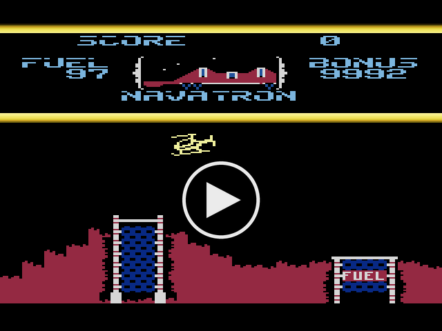

# Fort Apocalypse
The original Atari 400/800 6502 assembly code for the classic game Fort Apocalypse.

This is mainly being released for historical reasons. The original code is in the `atari` folder and requires a copy of SynAssembler to assemble.

[](https://rumbledethumps.github.io/FortApocalypse/)

[Play it in your browser](https://rumbledethumps.github.io/FortApocalypse/),
ported to the Picocomputer 6502 and running in its emulator. Click the
game to start it with sound. The controls are below.

## Picocomputer 6502

The `src` folder holds the game ported to the Picocomputer 6502. The game
is the original program converted to the ca65 syntax of the cc65 assembler,
at its original addresses (`fort1.s` to `fort8.s`, `fnt1.s`, `fnt2.s` and
`fort.s`). Around it, the rest of `src` does the work of the Atari hardware
and OS on the Picocomputer: `antic.s` draws the display lists with the VGA,
`gtia.s` draws the players and missiles as sprites and finds their
collisions, `pokey.s` plays the sound on the PSG, `input.s` reads the
keyboard and gamepads, and `os.s` runs the vertical blank. The main
program runs as fast as it ran on an NTSC Atari: each frame it has the
cycles that the Atari display DMA and interrupts left it.

### Controls

| Atari | Keyboard | Gamepad |
|---|---|---|
| Joystick | Arrows, WASD or the keypad | D-pad or left stick |
| Fire | Ctrl, Alt, Z, X or Enter | A, B, X or Y |
| START | F4 | Start |
| SELECT | F3 | Select |
| OPTION | F2 | L1 |
| Pause (space bar) | Space or P | R1 |

The Picocomputer 6502 build uses the
[RP6502 SDK](https://picocomputer.github.io/sdk.html) and the cc65 compiler.
Install the tools as that page describes, then build the ROM:

```bash
$ cmake --preset cc65/Release
$ cmake --build --preset cc65/Release
```

The ROM is `build/cc65/release/fort.rp6502`. Run it in the emulator with
`tools/rp6502-emu build/cc65/release/fort.rp6502`, or on a Picocomputer.
In VS Code, choose a cc65 preset and press F5. Each push to master
publishes the ROM with the web build of the emulator to GitHub Pages.

The tests in the `tests` folder are a host C program, built with the
host's own compiler, that runs the Release ROM in the emulator and checks
what it does. They use [utest.h](https://github.com/sheredom/utest.h).

```bash
$ cmake -S tests -B build/tests
$ cmake --build build/tests
$ ctest --test-dir build/tests --output-on-failure
```

## Notes

### Files in the atari folder:
	LEVEL.1P	Level 1. Pre ship.
	LEVEL.2P	Level 2. Pre ship.
	LEVEL.1N	Level 1. Shipped.
	LEVEL.2N	Level 2. Shipped.
	fnt1.s		Fort font 1. Alphabet.
	fnt2.s		Fort font 2. Graphics.
	fort.s		Main
	fort1.s		Game logic, setup
	fort2.s		Movement for pods, missiles, tanks, hyper chambers
	fort3.s		Chopper logic, robot brains
	fort4.s		Sprite logic, read joystick, draw map
	fort5.s		Sound generation, sprite updates
	fort6.s		Data, shapes, display Lists
	fort7.s		Variables
	fort8.s		Display list for navitron

### Level map format is:
	Bytes	
	0-1		header ID, not game related
	2-3		address to load, not game related
	4-5		length of data, not game related
	6		color1
	7		color2
	8		color3
	9		color4
	10		color5
	11-EOF	level data. each byte represents a character to use
			from the font.

Screen size is fixed to to 4 screens of 40 character wide.

### Sounds:
These were generated by pulling out just the code used to generate them and run on an emulator, then captured in all its 8-bit noisy glory.

	All in the sound_effects folder

	fort_chopper.aiff			The famous chopper sound
	fort_cruise_missile.aiff	Firing of a missile from a tank towards the player
	fort_explosion.aiff			The mega explision of the Fort Apocalypse
	fort_hyper.aiff				The Hyper Chamber sound when activated
	fort_missle.aiff			Firing of a missile from the players Chopper
	fort_refuel.aiff			The refueling sound

### License
Fort Apocalypse © 1995, 2007, 2015 Steve Hales.

Licensed under the Creative Commons Attribution-NonCommercial-NoDerivs 2.5
license. See [LICENSE](LICENSE) for the terms.
